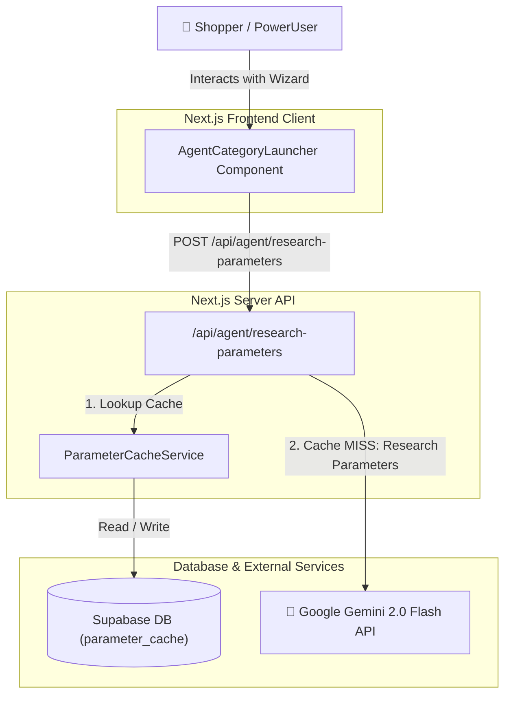
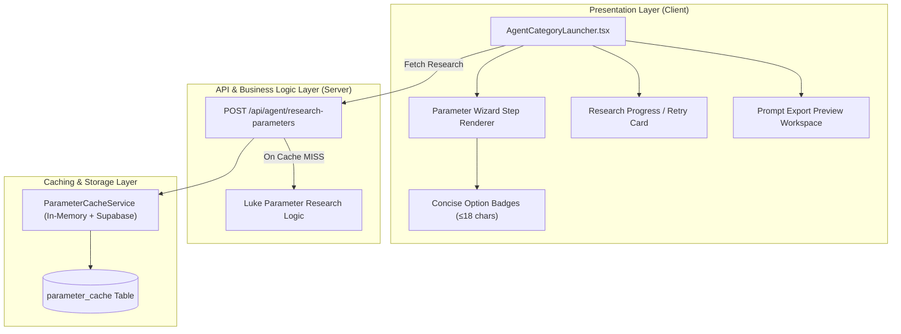
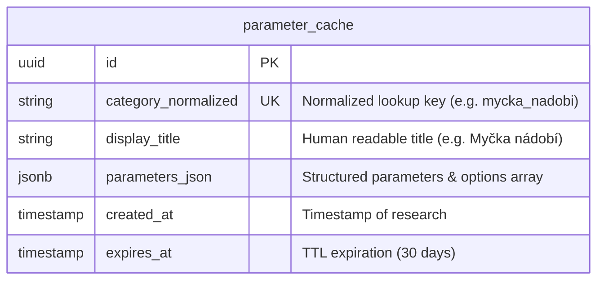

# Architecture Diagrams - bAIright Web Redesign (Wizard & UX)

**Source**: `docs/architecture/design/00-system-architecture-greenfield.md`  
**Generated**: 2026-09-16

> This file contains Mermaid diagrams extracted from the architecture document for easy preview.
> For full architecture details, refer to the source `.md` file.

---

## System Context Diagram

---

## Component Architecture Diagram

---

## Data Model / ER Diagram

