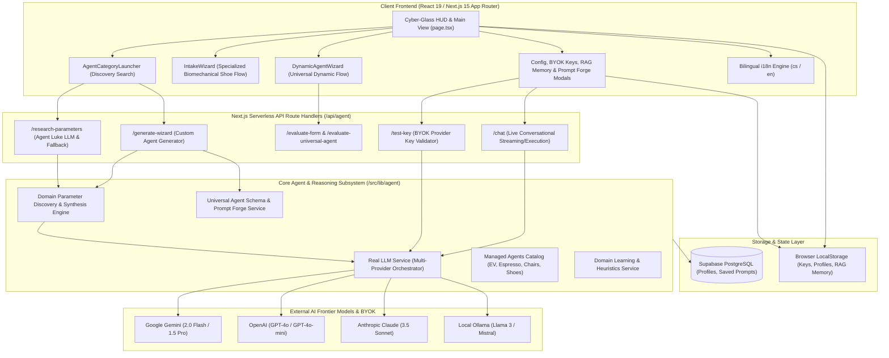

# Architecture Diagram Preview — bAIright System Overview

**Source**: `docs/architecture/current/00-system-overview.md`  
**Generated By**: ARCHITECT  
**Date**: 2026-09-15  

---

## 1. System Architecture & Component Interaction

