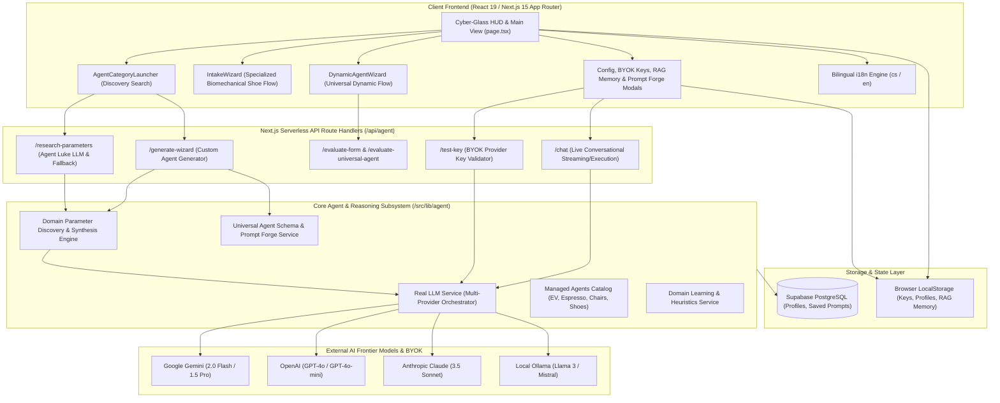

# System Overview - bAIright (Universal AI Shopping Consultant)

**Date**: 2026-09-15  
**Analyzed By**: ARCHITECT  
**Status**: Confirmed  

---

## Executive Summary

**bAIright** (formerly OrthoStride/shoes) is a Next.js 15 (React 19) full-stack web application that serves as a Universal AI Shopping Consultant and Deep Prompt Engineering Engine. It enables consumers to discover critical, non-obvious buying parameters across complex product domains (synthesized from engineering datasheets, teardowns, and enthusiast forums by persona **Agent Luke**), run tailored multi-step intake wizards, and compile precision-engineered system prompts for execution across frontier LLMs (Gemini, OpenAI, Claude, Ollama) via Bring-Your-Own-Key (BYOK).

---

## System Architecture

### Architecture Diagram

### Architecture Style
**Modular Next.js 15 Full-Stack Monolith**:
- **Presentation Layer**: Client Components (`"use client"`) built with React 19 and Tailwind CSS 4, utilizing a custom Cyber-glass dark aesthetic (`#070d18`, cyan `#06b6d4`, teal `#14b8a6`).
- **Application / Orchestration Layer**: Next.js App Router serverless API endpoints handling parameter research, agent generation, prompt evaluation, and key verification.
- **Domain & Reasoning Layer**: Strongly typed TypeScript domain models, offline fallback catalog profiles, and prompt compilation rules (`UniversalAgentDefinition`, `forgeAgentPrompt`).
- **Data & Client Isolation**: Zero server-side leakage of sensitive user keys; API keys are retained in client storage or securely passed in transient request headers for BYOK execution.

---

## Technology Stack

| Category | Technology | Version | Notes |
|----------|------------|---------|-------|
| Runtime & Language | Node.js / TypeScript | TS 5.8.2 | Strict mode enabled, zero `any` tolerance on public interfaces |
| Application Framework | Next.js (App Router) | 15.2.1 | Server and client component hybrid architecture |
| UI Library | React / React DOM | 19.0.0 | React 19 Concurrent features and hooks |
| Styling | Tailwind CSS / PostCSS | 4.0.9 | `@tailwindcss/postcss` with custom glassmorphism and animations |
| Icons & UI Utilities | Lucide React / clsx / tailwind-merge | 0.475.0 / 2.1.1 / 3.0.2 | Accessible icon components and dynamic class merging |
| Database & Backend-as-a-Service | Supabase JS Client | 2.49.1 | Optional cloud persistence for user profiles and prompts |
| Testing Framework | Vitest | 5.0.0 | High-speed unit/integration test runner in jsdom environment |
| Testing Utilities | React Testing Library / Jest-DOM | 16.3.3 / 7.0.1 | Component behavior validation |
| AI Integration | REST / Fetch SDKs | Native Fetch | Direct API integrations to Google Gemini, OpenAI, Anthropic, Ollama |

---

## Module Overview

| Module | Path | Responsibility | Dependencies |
|--------|------|----------------|--------------|
| **Core UI Views & Modals** | `src/components/` | 32 React components including `AgentCategoryLauncher`, `IntakeWizard`, `DynamicAgentWizard`, `AIEngineSubscriptionModal`, `UserRAGMemoryModal` | React 19, Lucide, Tailwind |
| **App Routing & Entry** | `src/app/` | `layout.tsx`, `page.tsx` (main single-page dashboard HUD), `globals.css` | React, Next.js |
| **API Endpoints** | `src/app/api/agent/` | 8 REST endpoints for parameter research, agent compilation, chat routing, evaluation, and key testing | NextRequest/NextResponse, `src/lib/agent/` |
| **Agent Parameter Discovery** | `src/lib/agent/domain-parameter-discovery.ts` | Persona Luke's deep parameter extraction engine, offline domain heuristic knowledge base (15+ curated product categories) | `universal-agent-schema.ts` |
| **Universal Schema & Forge** | `src/lib/agent/universal-agent-schema.ts` | Schema definitions (`UniversalAgentDefinition`), validation, and `forgeAgentPrompt` compiler | TypeScript core |
| **LLM Orchestration Service** | `src/lib/agent/real-llm-service.ts` | Multi-vendor API caller for Gemini, OpenAI, Claude, Ollama with fallback and streaming | Native Fetch |
| **Managed Agents Catalog** | `src/lib/agent/managed-agents-registry.ts` | Pre-configured versioned catalog of agents (EVs, Espresso machines, Ergonomic chairs, Biomechanical shoes) | `universal-agent-schema.ts` |
| **Markdown Agent Loader** | `src/lib/agent/markdown-agent-loader.ts` | Parses YAML frontmatter and markdown system prompts from `agents/*.md` | Regex / YAML parser |
| **Internationalization (i18n)** | `src/lib/i18n/translations.ts` | Comprehensive dual-language dictionary (`cs` Czech default, `en` English) | TypeScript |
| **Storage & Persistence** | `src/lib/storage/`, `src/lib/supabase.ts` | Local storage abstraction and optional Supabase PostgreSQL sync | `@supabase/supabase-js` |

---

## Entry Points

| Type | Path / Command | Description |
|------|----------------|-------------|
| **Web UI Application** | `src/app/page.tsx` | Main web entry point; coordinates launcher, intake wizard, dynamic wizard, and prompt HUD |
| **API: Parameter Discovery** | `src/app/api/agent/research-parameters/route.ts` | POST endpoint triggering Luke's deep web/forum parameter extraction |
| **API: Wizard Generator** | `src/app/api/agent/generate-wizard/route.ts` | POST endpoint generating interactive wizard questions from parameters |
| **API: Chat / Live Agent** | `src/app/api/agent/chat/route.ts` | POST endpoint executing live conversation or recommendation review via BYOK model |
| **API: Key Validator** | `src/app/api/agent/test-key/route.ts` | POST endpoint validating user-supplied API key against target LLM provider |
| **CLI / Dev Server** | `npm run dev` (`next dev`) | Starts local development server on `http://localhost:3000` |
| **CLI / Test Suite** | `npm test` (`vitest run`) | Executes full automated test suite (14 test files, 85 tests) |
| **CLI / Typecheck** | `npx tsc --noEmit` | Verifies TypeScript compilation and type safety |

---

## External Dependencies

### Key NPM Packages
| Package | Purpose |
|---------|---------|
| `next` | Next.js 15 App Router fullstack framework |
| `react` & `react-dom` | React 19 UI component runtime |
| `@supabase/supabase-js` | Official client library for Supabase database operations |
| `lucide-react` | Modern, lightweight SVG icon system |
| `vitest` | Ultra-fast unit testing framework powered by Vite |
| `@testing-library/react` | Behavioral DOM testing utilities |
| `tailwindcss` | Utility-first styling framework (v4 engine) |

### External Services & APIs
| Service | Purpose | Integration |
|---------|---------|-------------|
| **Google Gemini API** | Primary LLM engine (Gemini 2.0 Flash / 1.5 Pro) for parameter research & chat | Direct REST via `real-llm-service.ts` |
| **OpenAI API** | Secondary LLM engine (GPT-4o / GPT-4o-mini) for reasoning and chat | Direct REST via `real-llm-service.ts` |
| **Anthropic API** | Alternative frontier model (Claude 3.5 Sonnet) | Direct REST via `real-llm-service.ts` |
| **Ollama** | Self-hosted local inference endpoint (default `http://localhost:11434`) | Direct REST via `real-llm-service.ts` |
| **Supabase (PostgreSQL)** | Remote database for user profile and prompt storage | `@supabase/supabase-js` client |

---

## Design References (Legacy Documentation)

**Location**: `SPEC/references/` (Directory exists; currently empty of legacy binary docs).  
**Associated Project Specs**:
- `docs/AI_Shopping_Wizard_PRD.md` — Original Product Requirements Document detailing the 3-phase parameter research wizard flow, Agent Luke persona, and prompt forge architecture.
- `docs/PRODUCT_VISION.md` — Strategic product vision for bAIright as a universal shopping intelligence platform.
- `docs/bugs.md` — Bug tracking artifact for known UI and localization issues.

---

## Test Infrastructure

| Type | Location | Framework | Suite Results |
|------|----------|-----------|---------------|
| **Unit & Integration Tests** | `src/components/__tests__/`, `src/lib/agent/__tests__/` | Vitest 5.0.0 + JSDOM 30.0.1 + React Testing Library 16.3.3 | **14 files, 85 tests passing (100%)** |
| **Static Type Verification** | Root (`tsconfig.json`) | TypeScript Compiler (`tsc --noEmit`) | **0 errors (Clean)** |

---

## Configuration

| File | Purpose |
|------|---------|
| `.env.local` | Local environment overrides (API keys, Supabase URLs) |
| `next.config.ts` | Next.js compilation settings, images, and compiler options |
| `tsconfig.json` | TypeScript configuration (ESNext target, Bundler module resolution, `@/*` alias) |
| `postcss.config.mjs` | PostCSS configuration loading `@tailwindcss/postcss` |
| `vitest.config.ts` | Vitest test runner setup, jsdom environment, aliases |
| `vitest.setup.ts` | JSDOM polyfills, `@testing-library/jest-dom` extensions |

---

## Key Observations

### Strengths
1. **Exceptional Test Suite & Stability**: 100% test pass rate across 85 tests with zero TypeScript compilation warnings or errors.
2. **Robust Multi-LLM BYOK Architecture**: Direct, clean REST integrations with Google Gemini, OpenAI, Claude, and Ollama without vendor lock-in or heavyweight SDK bloat.
3. **Comprehensive Offline Intelligence (Fallback Engine)**: When no API key is supplied, `domain-parameter-discovery.ts` houses deeply researched, high-quality fallback profiles across major consumer sectors.
4. **Strict Security & Client Isolation**: Zero hardcoded secrets, safe local handling of user API keys complying with CodeGuard and OWASP standards.
5. **Full Localization**: Bilingual dictionary architecture (`cs` / `en`) with runtime switching across all launcher, wizard, and modal components.

### Areas of Concern
1. **Monolithic Component Complexity in Wizards**: `DynamicAgentWizard.tsx` (81 KB, 1,700+ lines) and `IntakeWizard.tsx` (70 KB, 1,500+ lines) contain significant internal state machine logic and UI rendering mixed together, which could benefit from decomposing into sub-components.
2. **Large Single-File Heuristics Database**: `domain-parameter-discovery.ts` (93 KB, 1,900+ lines) contains both heuristic data tables and execution logic in a single file.

### Technical Debt
1. **Console Warning during Test Execution**: In jsdom tests, minor React non-boolean attribute warnings (`priority="true"`, `fill="true"`) appear in stderr for Image/Logo elements.
2. **Dual Agent Systems**: The legacy specialized shoe agent (`IntakeWizard.tsx`) exists alongside the newer universal dynamic agent engine (`DynamicAgentWizard.tsx`); gradual unification under the universal schema is ongoing.
