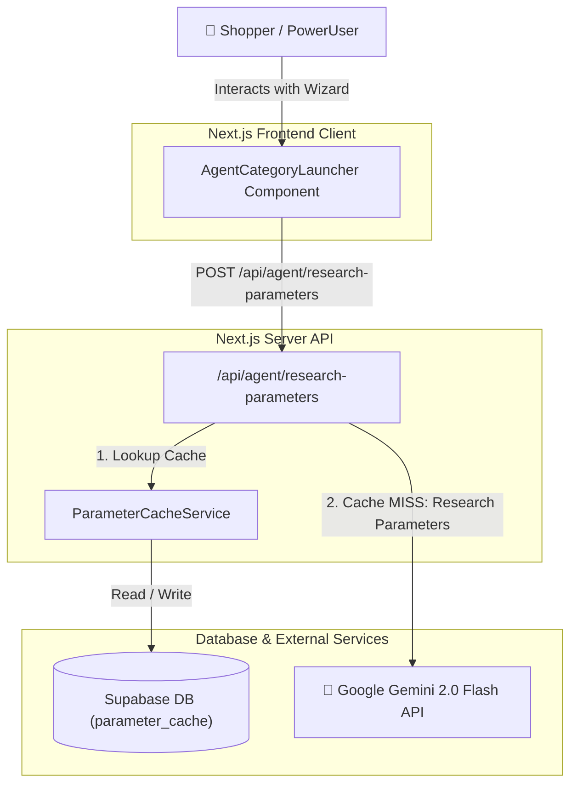
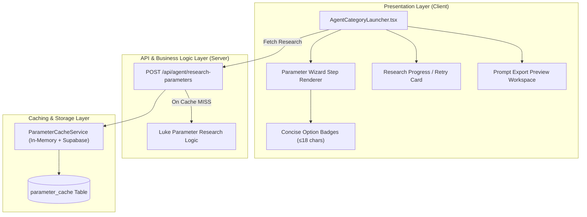
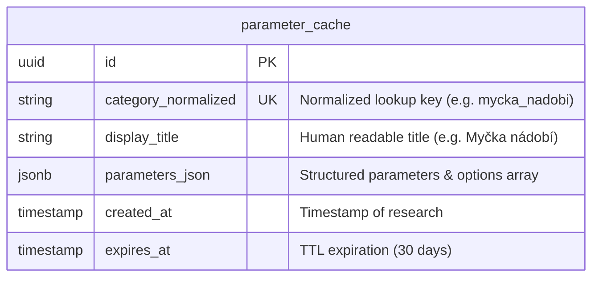

# System Architecture - bAIright Web Redesign (Wizard & UX)

**Date**: 2026-09-16  
**Author**: ARCHITECT  
**Status**: Approved  
**Version**: 1.0

---

## Overview

### Purpose
The **bAIright Web Redesign Architecture** defines the target system structure for the high-speed, modern minimalist shopping wizard interface. It optimizes user interactions, parameter research performance, and UI layout clarity.

### Architecture Style
Modular Full-Stack Monolith (Next.js 15 App Router) with Server-Side LLM Orchestration and Dual-Layer Caching.

### Key Drivers
- **UX Clarity & Speed**: Compact parameter badges (≤ 18 characters) and < 100ms UI step transitions.
- **Cache-First AI Research**: Immediate parameters return via Supabase cache with server-side Gemini 2.0 Flash research.
- **Zero Fallback Quality Gate**: Eliminates generic fallbacks (e.g. biometrics for dishwashers) by enforcing strict error/retry cards.

---

## Technology Stack

| Category | Technology | Version | Justification |
|----------|------------|---------|---------------|
| Language | TypeScript | ^5.6.0 | End-to-end type safety across API and UI |
| Framework | Next.js (App Router) | ^15.0.0 | React 19 Server/Client Components with edge API routes |
| UI Framework | React | ^19.0.0 | Declarative component state & fast rendering |
| Styling | Vanilla CSS Design System | Custom CSS | Clean, lightweight cyber-glass & minimal dark mode without utility overhead |
| Database / Cache | Supabase (PostgreSQL) | Latest | Shared server-side parameter cache table (`parameter_cache`) |
| AI Engine | Google Gemini API | `gemini-2.0-flash-lite` | High speed, cost-effective LLM parameter research |
| Testing | Vitest + React Testing Library | ^2.1.0 | Fast unit & integration testing suite |

---

## System Context



---

## Component Architecture



---

## Data Model



---

## API Design

### 1. `POST /api/agent/research-parameters`

**Request Body**:
```json
{
  "category": "myčka nádobí"
}
```

**Success Response (Cache HIT / LLM Output)**:
```json
{
  "ok": true,
  "source": "cache",
  "analysis": {
    "category": "myčka nádobí",
    "displayTitle": "Myčka Nádobí",
    "parameters": [
      {
        "id": "kapacita",
        "name": "Kapacita",
        "options": ["10 sad", "13–14 sad", "15+ sad"]
      },
      {
        "id": "hlucnost",
        "name": "Hlučnost",
        "options": ["Tichá (<42 dB)", "Standardní (44-46 dB)", "Nezáleží"]
      }
    ]
  }
}
```

**Error Response**:
```json
{
  "ok": false,
  "error": "Failed to research parameters for category",
  "details": "API connection error"
}
```

---

## Security Design

### Authentication & Authorization Alignment
Reconciled with the Roles & Permissions Matrix in `docs/requirements.md`:

- **Shopper**: Access to `wizard:use`, `parameters:select`, `prompt:generate`.
- **PowerUser**: Access to `byok:configure`, `advanced:tune`.
- **Admin**: Access to `cache:purge`, `admin:access`.

### Key Protection & OWASP Compliance
- `GOOGLE_GEMINI_API_KEY` is loaded exclusively in server-side API routes via `process.env.GOOGLE_GEMINI_API_KEY`.
- No API credentials or secrets are leaked to the client bundle.

---

## Technical Decisions (ADR)

### ADR-1: Concise Parameter Titles (≤ 18 chars)
- **Option A**: Long descriptive titles (e.g. "Požadované rozlišení a kvalita snímače fotoaparátu").
- **Option B (Chosen)**: Concise titles (e.g. "Fotoaparát").
- **Rationale**: Dramatically improves visual scanability and layout responsiveness on mobile/desktop screens.

### ADR-2: Server-Side Gemini 2.0 Flash + Supabase Caching
- **Option A**: Client-side BYOK API call for every search.
- **Option B (Chosen)**: Server-side Gemini 2.0 Flash with Supabase DB cache.
- **Rationale**: Eliminates friction for general users while drastically reducing latency via cached lookup results.
