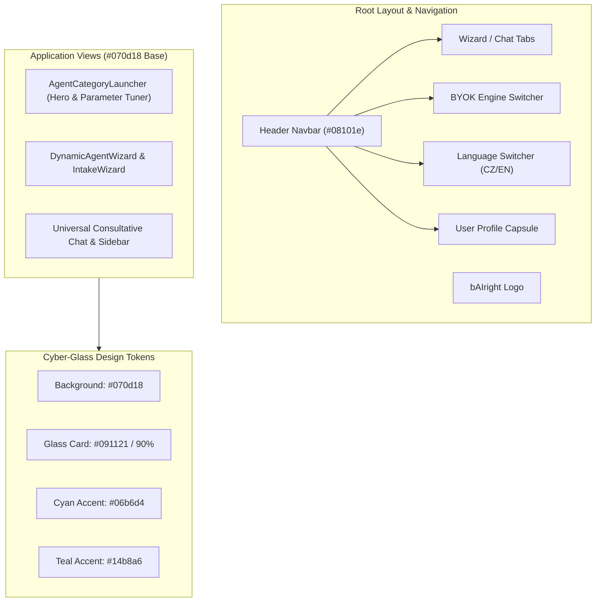

# Target Architecture — Unified Cyber-Glass Design System

**Date**: 2026-09-21  
**Author**: ARCHITECT  
**Status**: Approved  
**Version**: 2.0  
**Based On**: AGENTS.md framework rules & user request for 100% unified Cyber-Glass dark UI  

---

## Executive Overview

### Current State Issue
- Inconsistent color rendering across pages: selecting theme colors altered homepage backgrounds while nested components (DynamicAgentWizard, IntakeWizard, chat sidebars, parameter cards, modals) retained hardcoded cyan/blue/slate styling or hue-rotated incorrectly.
- Multiple theme switcher POCs (MaterialYouPOC, ColorPaletteModal, ThemeSwitcher) added complexity without full UI coverage.

### Target Architecture Solution
- **Single Source of Truth**: Enforce **100% unified Cyber-Glass Dark Design System** across the entire application (bAIright).
- **Color Palette**: Dark mode #070d18 / #08101e base with glowing Cyan #06b6d4 & Teal #14b8a6 accents.
- **De-duplication**: Remove all theme color switchers, palette modals, and data-theme CSS filter overrides.
- **Consistent Geometry**: Clean executive rounded-xl card boundaries, rounded-lg buttons/badges, and zero corner overflow.

---

## Delta Summary

| Component / Subsystem | Status | Description |
| :--- | :--- | :--- |
| globals.css | 🟡 Modified | Clean out all legacy data-theme overrides; set unified Cyber-Glass variables |
| ThemeContext.tsx | 🟡 Modified | Simplify to static Cyber-Glass theme provider |
| ColorPaletteModal.tsx | 🔴 Removed / Deprecated | Removed theme color picker modal |
| MaterialYouPOC.tsx | 🔴 Removed / Deprecated | Removed experimental Material 3 POC component |
| UserProfileCapsule.tsx | 🟡 Modified | Removed palette switcher button; enforce Cyber-Glass capsule style |
| HeaderEngineSwitcher.tsx | 🟡 Modified | Enforce Cyber-Glass capsule style |
| LanguageSwitcher.tsx | 🟡 Modified | Enforce Cyber-Glass capsule style (rounded-lg) |
| AgentCategoryLauncher.tsx | 🟡 Modified | Unified Cyber-Glass styling for hero search & parameter tuner |
| DynamicAgentWizard.tsx | 🟡 Modified | Unified Cyber-Glass card & background styling |
| IntakeWizard.tsx | 🟡 Modified | Unified Cyber-Glass intake step styling |
| UI Primitives (Card, Badge, Button, Toast) | 🟡 Modified | Enforce Cyber-Glass glowing cyan/teal accents |

---

## Component Architecture

---

## Quality Gate Verification
- **TypeScript**: npx tsc --noEmit must pass with 0 errors.
- **Vitest**: npx vitest run must pass 100% (25 test files, 170 tests).
- **OWASP/CodeGuard**: Zero API key leakage; safe local state mutation.
