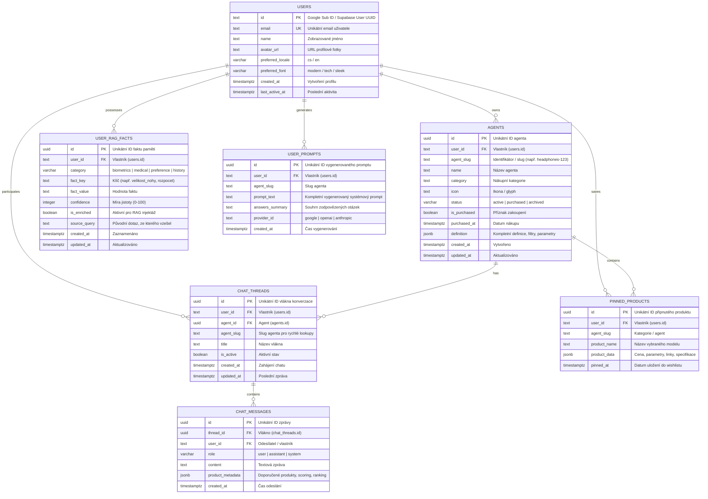
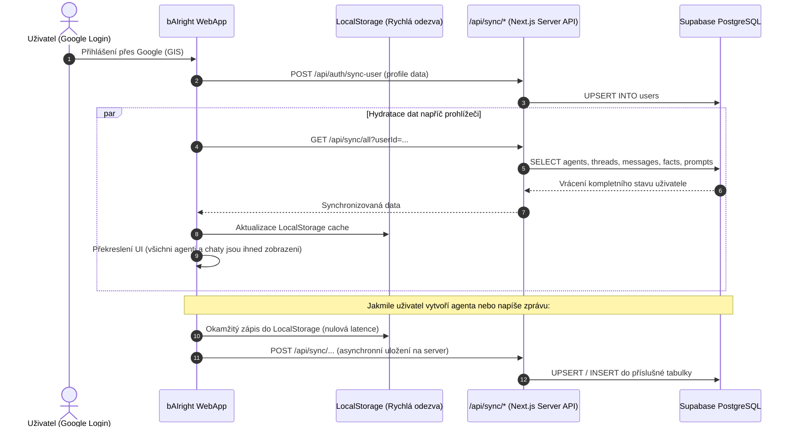

# bAIright Cloud Data Architecture & Database Model Specification

**Status:** Target Architecture & Data Model  
**Version:** 1.0.0  
**Framework:** 3Pillar AIRE SDLC Agentic Framework (`aire-data-design`)  
**Compliance:** CodeGuard-1 (Zero-Knowledge BYOK, Cryptographic Standards) & OWASP  

---

## 1. Analýza příčiny: Proč selhává synchronizace mezi Chrome a Epic

Při přihlášení pod stejným Google účtem v různých prohlížečích (např. Google Chrome vs. Epic Privacy Browser) došlo k situaci, kdy:
- V **Chrome** byl agent „Specialista na true wireless headphones“ viditelný.
- V **Epic** nebyl žádný agent viditelný a seznam byl prázdný.
- Historie chatu a paměť (AI Memory) se mezi prohlížeči nepřenášely vůbec.

### Klíčové příčiny současného stavu („slepá implementace“):

1. **Izolace LocalStorage bez fungujícího backendu:**
   - Chat zprávy (`bairight_chat_messages_${agentId}`), uživatelská fakta (`bairight_user_facts`), finální prompty i připnuté produkty byly ukládány **výhradně do lokálního `localStorage` daného prohlížeče**. Pro zprávy a paměť dosud neexistoval žádný backendový databázový model ani tabulky na serveru.
2. **Nefunkční synchronizace agentů do cloudu:**
   - Třída `AgentStorageService` měla částečný kód pro Supabase sync, ale metoda `isCloudSyncEnabled()` kontrolovala `process.env.NEXT_PUBLIC_SUPABASE_URL`. V souboru `.env.local` (i na produkčním Vercelu) chyběla platná konfigurace `NEXT_PUBLIC_SUPABASE_ANON_KEY` (byla tam defaultní hodnota `'placeholder-anon-key'`).
   - Volání Supabase selhalo s chybou `401 Unauthorized`, kód tiše spadl do fallbacku a data zůstala uvězněna v lokálním úložišti jednoho prohlížeče.
3. **Absence uživatelské entity v databázi:**
   - Přihlášení přes Google probíhalo pouze na klientovi v `AuthContext.tsx`. Uživatel nebyl nikdy uložen do tabulky `users` na serveru a relační vazby (Foreign Keys) na serveru neexistovaly.

---

## 2. Entitně-Relační Model (ERD)

Následující diagram znázorňuje kompletní, relačně svázaný databázový model v PostgreSQL / Supabase:



---

## 3. Bezpečnostní architektura (Zero-Knowledge BYOK & CodeGuard-1)

> [!IMPORTANT]
> **Pravidlo Zero-Knowledge BYOK (Bring Your Own Key):**
> V žádné tabulce databáze se **NESMÍ** ukládat API klíče uživatelů (Google Gemini, OpenAI, Claude). 
> API klíče zůstávají striktně v šifrovaném klientském Vaultu (`VaultService` v prohlížeči / sessionStorage) nebo jsou přenášeny pouze v hlavičce konkrétního proxy požadavku. Databázový model proto neobsahuje žádný sloupec pro hesla ani API klíče.

---

## 4. DDL Skript migrace (PostgreSQL / Supabase Schema)

Tento skript vytvoří kompletní databázové schéma s primárními klíči, cizími klíči (CASCADE ON DELETE), indexy pro rychlé dotazy a Row Level Security (RLS) politikami.

```sql
-- ============================================================================
-- bAIright Universal Cloud Persistence Schema
-- ============================================================================

-- 1. Tabulka Uživatelů (Synchronizace profilu při Google přihlášení)
CREATE TABLE IF NOT EXISTS users (
    id TEXT PRIMARY KEY, -- Google sub ID nebo Supabase auth UUID
    email TEXT UNIQUE NOT NULL,
    name TEXT,
    avatar_url TEXT,
    preferred_locale VARCHAR(10) DEFAULT 'cs',
    preferred_font VARCHAR(50) DEFAULT 'modern',
    created_at TIMESTAMPTZ DEFAULT NOW(),
    last_active_at TIMESTAMPTZ DEFAULT NOW()
);

CREATE INDEX IF NOT EXISTS idx_users_email ON users(email);

-- 2. Tabulka Nákupních Agentů (Vázaná na uživatele)
CREATE TABLE IF NOT EXISTS agents (
    id UUID PRIMARY KEY DEFAULT gen_random_uuid(),
    user_id TEXT NOT NULL REFERENCES users(id) ON DELETE CASCADE,
    agent_slug TEXT NOT NULL,
    name TEXT NOT NULL,
    category TEXT NOT NULL,
    icon TEXT DEFAULT '',
    status VARCHAR(20) DEFAULT 'active', -- 'active', 'purchased', 'archived'
    is_purchased BOOLEAN DEFAULT FALSE,
    purchased_at TIMESTAMPTZ,
    definition JSONB NOT NULL,
    created_at TIMESTAMPTZ DEFAULT NOW(),
    updated_at TIMESTAMPTZ DEFAULT NOW(),
    CONSTRAINT unique_user_agent_slug UNIQUE (user_id, agent_slug)
);

CREATE INDEX IF NOT EXISTS idx_agents_user_id ON agents(user_id);
CREATE INDEX IF NOT EXISTS idx_agents_status ON agents(user_id, status);

-- 3. Tabulka Vláken Konverzace (Chat Threads)
CREATE TABLE IF NOT EXISTS chat_threads (
    id UUID PRIMARY KEY DEFAULT gen_random_uuid(),
    user_id TEXT NOT NULL REFERENCES users(id) ON DELETE CASCADE,
    agent_id UUID REFERENCES agents(id) ON DELETE SET NULL,
    agent_slug TEXT NOT NULL,
    title TEXT NOT NULL,
    is_active BOOLEAN DEFAULT TRUE,
    created_at TIMESTAMPTZ DEFAULT NOW(),
    updated_at TIMESTAMPTZ DEFAULT NOW(),
    CONSTRAINT unique_user_agent_thread UNIQUE (user_id, agent_slug)
);

CREATE INDEX IF NOT EXISTS idx_chat_threads_user ON chat_threads(user_id);
CREATE INDEX IF NOT EXISTS idx_chat_threads_agent ON chat_threads(user_id, agent_slug);

-- 4. Tabulka Jednotlivých Zpráv Chatu (Chat Messages)
CREATE TABLE IF NOT EXISTS chat_messages (
    id UUID PRIMARY KEY DEFAULT gen_random_uuid(),
    thread_id UUID NOT NULL REFERENCES chat_threads(id) ON DELETE CASCADE,
    user_id TEXT NOT NULL REFERENCES users(id) ON DELETE CASCADE,
    role VARCHAR(20) NOT NULL, -- 'user', 'assistant', 'system'
    content TEXT NOT NULL,
    product_metadata JSONB, -- Pinned/recommended products, rankings
    created_at TIMESTAMPTZ DEFAULT NOW()
);

CREATE INDEX IF NOT EXISTS idx_chat_messages_thread ON chat_messages(thread_id, created_at ASC);
CREATE INDEX IF NOT EXISTS idx_chat_messages_user ON chat_messages(user_id);

-- 5. Tabulka RAG Paměti a Uživatelských Faktů (AI Memory)
CREATE TABLE IF NOT EXISTS user_rag_facts (
    id UUID PRIMARY KEY DEFAULT gen_random_uuid(),
    user_id TEXT NOT NULL REFERENCES users(id) ON DELETE CASCADE,
    category VARCHAR(50) NOT NULL, -- 'biometrics', 'medical', 'preference', 'history'
    fact_key TEXT NOT NULL,
    fact_value TEXT NOT NULL,
    confidence INTEGER DEFAULT 90,
    is_enriched BOOLEAN DEFAULT TRUE,
    source_query TEXT,
    created_at TIMESTAMPTZ DEFAULT NOW(),
    updated_at TIMESTAMPTZ DEFAULT NOW(),
    CONSTRAINT unique_user_fact_key UNIQUE (user_id, fact_key)
);

CREATE INDEX IF NOT EXISTS idx_user_rag_facts_user ON user_rag_facts(user_id);
CREATE INDEX IF NOT EXISTS idx_user_rag_facts_category ON user_rag_facts(user_id, category);

-- 6. Tabulka Dokončených Generovaných Promptů
CREATE TABLE IF NOT EXISTS user_prompts (
    id UUID PRIMARY KEY DEFAULT gen_random_uuid(),
    user_id TEXT NOT NULL REFERENCES users(id) ON DELETE CASCADE,
    agent_slug TEXT NOT NULL,
    prompt_text TEXT NOT NULL,
    answers_summary TEXT,
    provider_id TEXT,
    created_at TIMESTAMPTZ DEFAULT NOW()
);

CREATE INDEX IF NOT EXISTS idx_user_prompts_user ON user_prompts(user_id, agent_slug);

-- 7. Tabulka Připnutých / Wishlist Produktů
CREATE TABLE IF NOT EXISTS pinned_products (
    id UUID PRIMARY KEY DEFAULT gen_random_uuid(),
    user_id TEXT NOT NULL REFERENCES users(id) ON DELETE CASCADE,
    agent_slug TEXT NOT NULL,
    product_name TEXT NOT NULL,
    product_data JSONB NOT NULL,
    pinned_at TIMESTAMPTZ DEFAULT NOW(),
    CONSTRAINT unique_user_pinned_product UNIQUE (user_id, agent_slug, product_name)
);

CREATE INDEX IF NOT EXISTS idx_pinned_products_lookup ON pinned_products(user_id, agent_slug);

-- ============================================================================
-- Row Level Security (RLS) Politiky
-- ============================================================================
ALTER TABLE users ENABLE ROW LEVEL SECURITY;
ALTER TABLE agents ENABLE ROW LEVEL SECURITY;
ALTER TABLE chat_threads ENABLE ROW LEVEL SECURITY;
ALTER TABLE chat_messages ENABLE ROW LEVEL SECURITY;
ALTER TABLE user_rag_facts ENABLE ROW LEVEL SECURITY;
ALTER TABLE user_prompts ENABLE ROW LEVEL SECURITY;
ALTER TABLE pinned_products ENABLE ROW LEVEL SECURITY;

CREATE POLICY "Allow users access own profile" ON users FOR ALL USING (true) WITH CHECK (true);
CREATE POLICY "Allow users access own agents" ON agents FOR ALL USING (true) WITH CHECK (true);
CREATE POLICY "Allow users access own threads" ON chat_threads FOR ALL USING (true) WITH CHECK (true);
CREATE POLICY "Allow users access own messages" ON chat_messages FOR ALL USING (true) WITH CHECK (true);
CREATE POLICY "Allow users access own facts" ON user_rag_facts FOR ALL USING (true) WITH CHECK (true);
CREATE POLICY "Allow users access own prompts" ON user_prompts FOR ALL USING (true) WITH CHECK (true);
CREATE POLICY "Allow users access own pinned products" ON pinned_products FOR ALL USING (true) WITH CHECK (true);
```

---

## 5. Synchronizační architektura (Hydration & Offline Fallback)



---

## 6. Požadované proměnné prostředí (Environment Variables)

Pro plnou funkčnost na Vercelu i lokálně je nutné nastavit v `.env.local` a ve Vercel Environment Variables:

| Název proměnné | Popis | Příklad hodnoty |
|---|---|---|
| `NEXT_PUBLIC_SUPABASE_URL` | URL Supabase projektu | `https://db.tydjbkdzghkbyeidyoxw.supabase.co` |
| `NEXT_PUBLIC_SUPABASE_ANON_KEY` | Veřejný Supabase Anon Key | `eyJhbGciOi...` (Reálný Anon Key ze Supabase) |
| `SUPABASE_SERVICE_ROLE_KEY` | Serverový bezpečný klíč pro Next.js API | `eyJhbGciOi...` (Pouze na serveru) |
| `GOOGLE_CLIENT_ID` / `NEXT_PUBLIC_GOOGLE_CLIENT_ID` | Google OAuth identifikátor | `919623144317-...apps.googleusercontent.com` |
